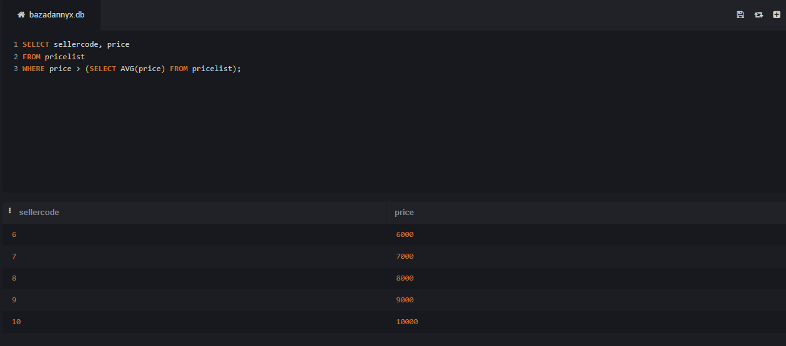

## 1. Симонов Илья, ИС 22/9-1

## 2. Описание базы данных

- База данных спроектирована для управления информацией о магазине. В ней содержатся следующие сущности (таблицы) и их атрибуты:

  ### 2.1. Таблица `sellers`

  - **Колонки:**
    - `code` (int)
    - `name` (varchar)
    - `address` (text)
    - `phone` (varchar)
    - `website` (varchar)


- **Описание:** Содержит информацию о продавцах.

  ### 2.2. Таблица `products`

  - **Колонки:**
    - `code` (int)
    - `name` (varchar)


- **Описание:** Содержит информацию о продуктах.

  ### 2.3. Таблица `models`

  - **Колонки:**
    - `code` (int)
    - `name` (varchar)
    - `manufacturercode` (int)


- **Описание:** Содержит информацию о моделях.

  ### 2.4. Таблица `pricelist`

  - **Колонки:**
    - `recordcode` (int)
    - `sellercode` (int)
    - `manufacturercode` (int)
    - `productcode` (int)
    - `modelcode` (int)
    - `price` (numeric)


- **Описание:** Содержит информацию о ценах.

  ### 2.5. Таблица `manufacturers`

  - **Колонки:**
    - `code` (int)
    - `name` (varchar)
    - `country` (varchar)
    - `website` (varchar)


- **Описание:** Содержит информацию о производителях.

## 3. Демонстрация работы функции `UNION`

```sql
SELECT name, phone FROM sellers
UNION
SELECT name, website FROM manufacturers;
```


- **Описание:** Этот запрос объединяет имена и телефоны продавцов с именами и веб-сайтами производителей, используя функцию `UNION`.

## 4. Демонстрация работы функции `ORDER BY`

```sql
SELECT sellercode, price FROM pricelist
ORDER BY price DESC;
```


- **Описание:** Этот запрос сортирует товары из прайс-листа по убыванию цены, используя функцию `ORDER BY`.

## 5. Демонстрация работы функции `HAVING`

```sql
SELECT productcode, COUNT(*) AS product_count
FROM pricelist
GROUP BY productcode
HAVING COUNT(*) > 0;
```


- **Описание:** Этот запрос группирует товары по коду продукта и показывает только те, у которых больше 0 записей, используя функцию `HAVING`.

## 6. Демонстрация работы вложенных запросов

  ### 6.1. В `SELECT`

  ```sql
  SELECT name, (SELECT COUNT(*) FROM pricelist WHERE sellercode = s.code) AS product_count
  FROM sellers AS s;
  ```


- **Описание:** Этот запрос показывает имена продавцов и количество товаров, которые они продают, используя вложенный запрос в `SELECT`.

  ### 6.2. В `WHERE`

  ```sql
  SELECT sellercode, price
  FROM pricelist
  WHERE price > (SELECT AVG(price) FROM pricelist);
  ```



- **Описание:** Этот запрос показывает товары, цена которых выше средней, используя вложенный запрос в `WHERE`.

## 7. Демонстрация работы оконных функций

  ### 7.1. Агрегатные функции

  ```sql
  SELECT sellercode, price, AVG(price) OVER() AS avg_price
  FROM pricelist;
  ```


- **Описание:** Этот запрос показывает товары и их среднюю цену, используя оконную функцию `AVG`.

  ### 7.2. Ранжирующие функции

  ```sql
  SELECT sellercode, price, RANK() OVER(ORDER BY price DESC) AS rank
  FROM pricelist;
  ```


- **Описание:** Этот запрос показывает товары и их ранг по убыванию цены, используя оконную функцию `RANK`.

  ### 7.3. Функции смещения

  ```sql
  SELECT sellercode, price, LAG(price, 1) OVER(ORDER BY price) AS previous_price
  FROM pricelist;
  ```


- **Описание:** Этот запрос показывает товары и их предыдущую цену, используя оконную функцию `LAG`.

## 8. Демонстрация работы `join`-ов

  ### 8.1. `INNER JOIN`

  ```sql
  SELECT s.name AS seller_name, m.name AS model_name
  FROM sellers AS s
  INNER JOIN pricelist AS p ON s.code = p.sellercode
  INNER JOIN models AS m ON p.modelcode = m.code;
  ```


- **Описание:** Этот запрос показывает имена продавцов и названия моделей, которые они продают, используя `INNER JOIN`.

  ### 8.2. `LEFT JOIN`

  ```sql
  SELECT s.name AS seller_name, m.name AS model_name
  FROM sellers AS s
  LEFT JOIN pricelist AS p ON s.code = p.sellercode
  LEFT JOIN models AS m ON p.modelcode = m.code;
  ```


- **Описание:** Этот запрос показывает имена продавцов и названия моделей, которые они продают, если таковые имеются, используя `LEFT JOIN`.

  ### 8.3. `RIGHT JOIN`

  ```sql
  SELECT *
  FROM pricelist
  RIGHT JOIN products ON pricelist.productcode = products.code;
  ```
  


- **Описание:** Этот запрос выводит строки из pricelist, к которым прикреплены соответствующие строки из products, иначе NULL.

  ### 8.4. `CROSS JOIN`

  ```sql
  SELECT *
  FROM sellers
  CROSS JOIN products;
  ```


- **Описание:** Этот запрос выводит все возможные комбинации строк из sellers и products.

  ### 8.5. `FULL OUTER JOIN`

  ```sql
  SELECT *
  FROM sellers
  FULL OUTER JOIN pricelist ON sellers.code = pricelist.sellercode;
  ```


- **Описание:** Этот запрос выводит все строки из sellers и pricelist, объединенные вместе по их кодам продавцов, с NULL значениями там, где соответствующих значений нет.

## 9. Демонстрация работы `CASE`

```sql
SELECT sellercode, 
       CASE 
         WHEN price > 100 THEN 'Expensive' 
         ELSE 'Affordable' 
       END AS price_category
FROM pricelist;
```


- **Описание:** Этот запрос показывает товары и их ценовую категорию (дорогие или доступные), используя функцию `CASE`.

## 10. Демонстрация работы `WITH`

```sql
WITH SellerInfo AS (
    SELECT code, name, address
    FROM sellers
)

SELECT *
FROM SellerInfo;
```


- **Описание:** Этот запрос создает временный набор данных под названием SellerInfo, который содержит код, имя и адрес всех продавцов из таблицы sellers. Затем основной запрос просто выбирает все столбцы из временного набора данных SellerInfo.